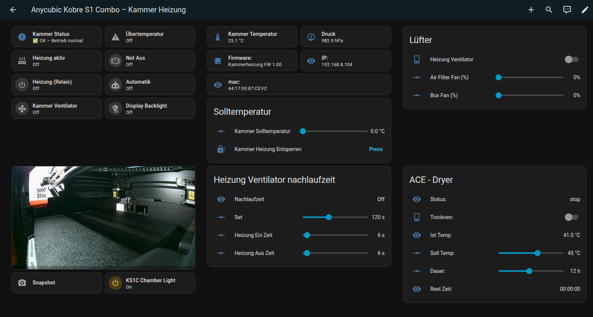

# KS1C – Kammerheizung (ESPHome + Home Assistant)

⚠️ <strong>WICHTIG – DIY-PROJEKT!</strong>  

Dieses Projekt ist ein reines DIY-Projekt.  
Der Nachbau erfolgt **auf eigene Gefahr**.  
Ich übernehme **keinerlei Haftung** für Schäden an Personen, Geräten oder Eigentum.

⚠️ <strong>DRUCKMATERIAL:</strong>  

Alle 3D-gedruckten Teile **MÜSSEN aus ASA** (oder gleichwertig hitzebeständigem Material) gedruckt werden.  
PLA, PETG oder ABS sind **nicht geeignet**!

---

🔥 **ESP32-basierte Kammerheizung für geschlossene 3D-Drucker**  
Mit automatischer Temperaturregelung, Sicherheitsfunktionen, Display  
und direkter Integration in **Home Assistant** und **Moonraker**.

---

## 📸 Projektbilder

### Dashboard

---

## ✨ Features

- ESP32 (TTGO T-Display) mit integriertem TFT-Display
- Temperaturregelung für geschlossene Druckkammern
- Zwei **Solid State Relais (SSR)** für:
  - Heizung (230 V)
  - Kammerlüfter (230 V)
- **Taktbetrieb** für überdimensionierte Heizungen
- Lüfter-Vorlauf & Nachlauf
- **Not-Aus**, Übertemperaturschutz & WLAN-Failsafe
- Native **ESPHome-Integration**
- **Moonraker-Anbindung** für MMU-Dryer-Status
- Vollständig lokal, kein Cloud-Zwang

---

## 🧠 Systemübersicht

Dieses Projekt ist strikt in **zwei Spannungsbereiche** getrennt:

| Bereich | Spannung | Beschreibung |
|------|--------|-------------|
| Niederspannung | 3,3 V DC | ESP32, Sensoren, SSR-Eingänge |
| Netzspannung | 230 V AC | Heizung, Lüfter |

👉 Die Trennung erfolgt **ausschließlich über Solid State Relais**.

---

## 🧯 Sicherheitsfunktionen

- ❌ **Übertemperatur > 65 °C** → Sofortige Abschaltung
- 📡 **WLAN-Ausfall** → Hard-Shutdown + manuelle Entsperrung nötig
- 🛑 **Not-Aus** → Heizung AUS, Lüfter EIN
- 🌀 **Lüfter-Nachlauf** nach Heizende

---

## ⚠️ Wichtiger Hinweis

Dieses Projekt arbeitet mit **230 V Netzspannung**.  
Falsche Verdrahtung kann **lebensgefährlich** sein.

> ❗ Nachbau nur, wenn du weißt, was du tust.  
> ❗ Immer Sicherungen, Erdung und geschlossenes Gehäuse verwenden.

---

## 📄 Lizenz

Dieses Projekt ist für private Nutzung gedacht.  
Siehe `LICENSE` Datei für Details.

---

## Credits

Projekt & Umsetzung: **jeng37**  
ESPHome • Home Assistant • Moonraker Community
